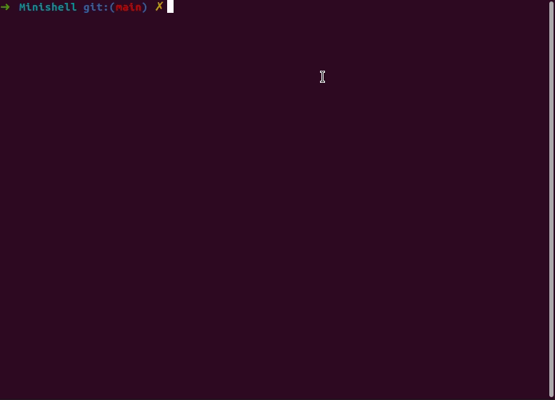

# 🌱 Minishell
<strong>Status: Finished</strong><br/>
🥅 A recreation of simple bash shell. <br/>

<div></div>

☑️ Input prompt.
☑️ built-ins support: echo, cd, setenv, unsetenv, env, exit.
☑️ Seperation of command with ";".
☑️ Simple double quote (") inhibitor.
☑️ Management of signal with Ctrl-C

## Usage
<i>compatible with MacOs and Linux</i>

```bash
$ make
$ ./minishell
```
